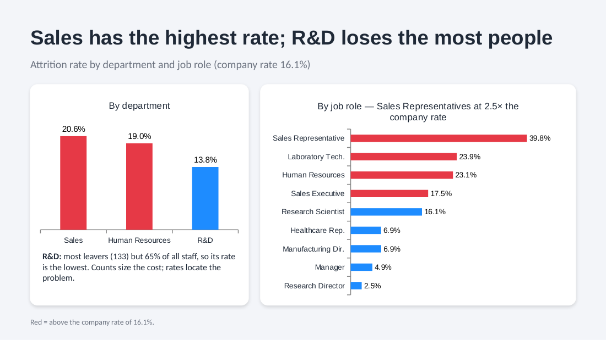
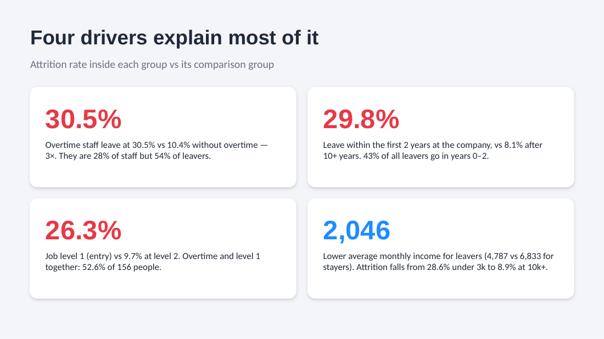
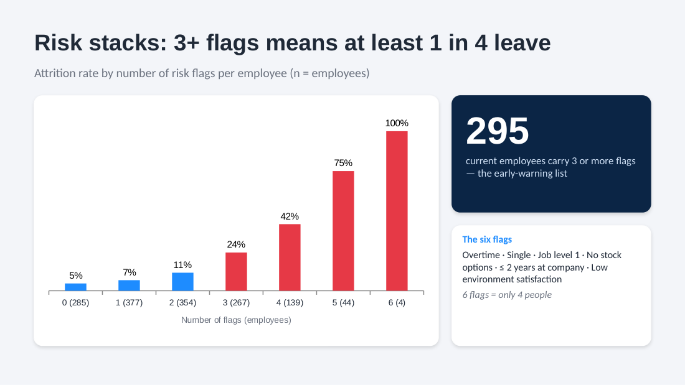
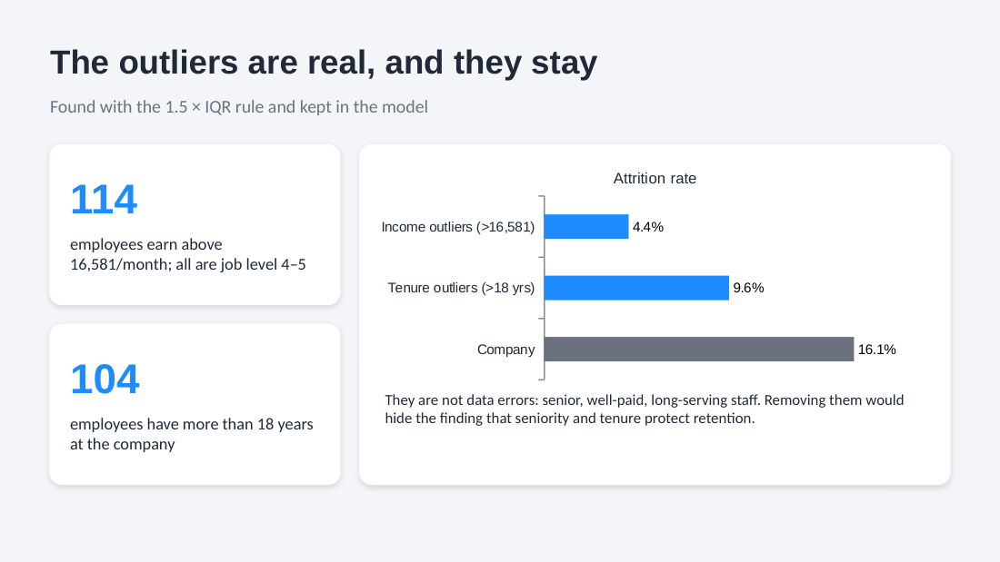
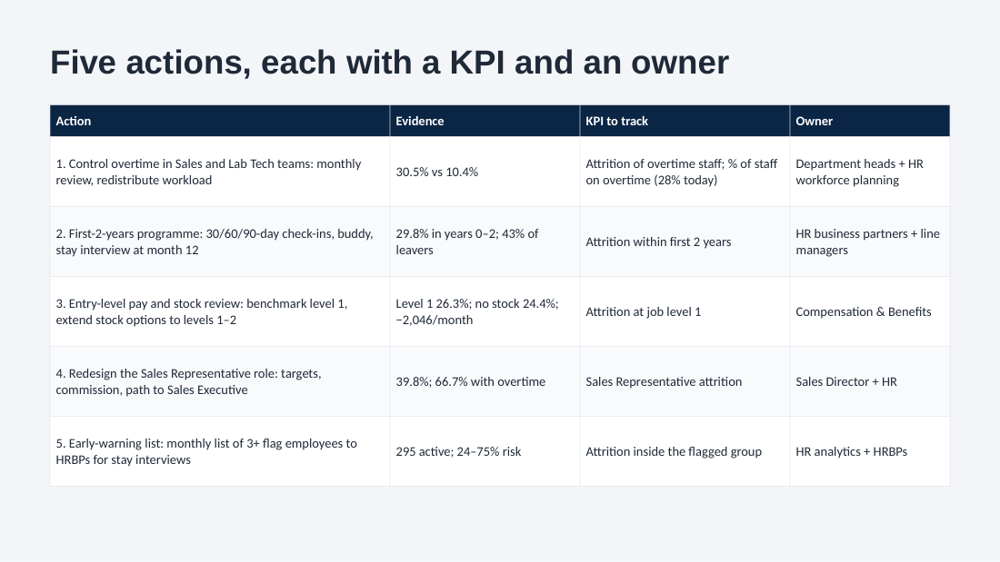
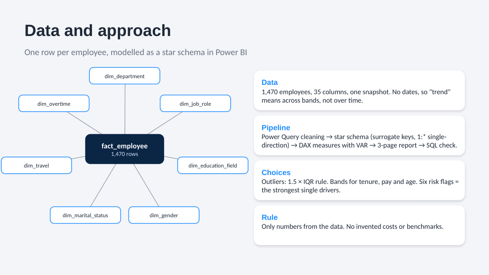

# HR Attrition Dashboard (Power BI)

An HR team sees one in six employees leave but cannot tell where it happens, why, or who is likely to go next, so retention money gets spread across everyone. This Power BI report answers all three and ends with an early-warning list: **295 current employees who carry three or more risk flags**, a group where 35% have already left.

## What it found

| Question | Answer |
|---|---|
| How many leave? | 237 of 1,470, a 16.1% attrition rate |
| Where? | Sales has the highest rate (20.6%); R&D loses the most people (133) but is 65% of staff, so its rate is the lowest (13.8%) |
| Which role? | Sales Representatives at 39.8%, two and a half times the company rate |
| Why? | Overtime: 30.5% leave against 10.4% without it. Overtime staff are 28% of the workforce but 54% of leavers |
| When? | The first two years: 29.8% leave in that window, and it holds 43% of all leavers (8.1% after more than 10 years) |
| Who else? | Job level 1 at 26.3% (9.7% at level 2); overtime and level 1 together, 52.6% of 156 people. Leavers earn 2,046 a month less on average |
| Who is at risk now? | 295 current employees carry 3 or more of the six risk flags |





## Risk flags: the early-warning list

Each employee gets one flag for each of the six strongest single drivers: overtime, single, job level 1, no stock options, two years or less at the company, and low environment satisfaction. Attrition climbs as the flags stack: 4.6% with none, 24% with three, 42% with four and 75% with five (six flags is only four people). The 295 current employees with three or more flags are the list HR can act on this month.



## Outliers

Found with the 1.5 × IQR rule and kept in the model: 114 employees earn above 16,581 a month (all at job level 4 or 5) and only 4.4% of them leave; 104 have more than 18 years at the company, at 9.6%. They are senior, well-paid, long-serving staff, not data errors, and removing them would hide the finding that seniority and tenure protect retention.



## Five actions, each with a KPI and an owner



1. **Control overtime** in Sales and the Lab Tech teams. KPI: attrition of overtime staff and the share of staff on overtime (28% today).
2. **A first-two-years programme:** 30/60/90-day check-ins, a buddy, a stay interview at month 12. KPI: attrition within the first two years.
3. **Entry-level pay and stock review:** benchmark level 1, extend stock options to levels 1 and 2. KPI: attrition at job level 1.
4. **Redesign the Sales Representative role:** targets, commission, a path to Sales Executive. KPI: Sales Representative attrition.
5. **The early-warning list,** sent monthly to HR business partners for stay interviews. KPI: attrition inside the flagged group.

## How it is built



- **Power Query:** one staging query cleans the sheet; each dimension is built from its distinct values with an index as the surrogate key, and `fact_employee` looks up the seven keys and keeps only the grain (EmployeeNumber), the keys, the `AttritionFlag` and the numeric facts.
- **Star schema:** `fact_employee` (one row per employee, 1,470 rows) with `dim_department`, `dim_job_role`, `dim_education_field`, `dim_gender`, `dim_marital_status`, `dim_travel` and `dim_overtime`, all one-to-many with a single filter direction. Measures live in their own `_Measures` table.
- **DAX:** 15 measures written with variables, from `Headcount`, `Leavers` and `Attrition Rate %` to the outlier thresholds (`PERCENTILE.INC` for the 1.5 × IQR rule) and `High-Risk Active Employees`, plus calculated columns for the age, tenure and income bands and the `Risk Flags` count. All of them are in [`dax/measures.dax`](dax/measures.dax), copied out of the model.

```dax
Risk Flags =
VAR _OverTime    = RELATED ( dim_overtime[OverTime] ) = "Yes"
VAR _Single      = RELATED ( dim_marital_status[MaritalStatus] ) = "Single"
VAR _EntryLevel  = fact_employee[JobLevel] = 1
VAR _NoStock     = fact_employee[StockOptionLevel] = 0
VAR _EarlyTenure = fact_employee[YearsAtCompany] <= 2
VAR _LowEnvSat   = fact_employee[EnvironmentSatisfaction] = 1
RETURN INT ( _OverTime ) + INT ( _Single ) + INT ( _EntryLevel ) + INT ( _NoStock ) + INT ( _EarlyTenure ) + INT ( _LowEnvSat )
```

- **Report:** a home page and three pages (Overview, Drivers, Trends and Outliers), plus a tooltip page for segments.
- **SQL check:** [`sql/attrition_by_department.sql`](sql/attrition_by_department.sql) counts leavers per department on the raw table (R&D 133, Sales 92, Human Resources 12), matching the report.
- **Checks:** every number above was recomputed outside Power BI from the model's own tables.

## Limits

One snapshot with no dates, so there is no true time trend; no exit reasons, so the drivers are correlations, not proven causes; some groups are small (six flags: four people). The next step is monthly HR snapshots and exit-interview reasons, then a pilot of actions 1 and 2 in Sales and Lab Tech.

## Data

[IBM HR Analytics Employee Attrition](https://www.kaggle.com/datasets/pavansubhasht/ibm-hr-analytics-attrition-dataset) on Kaggle: 1,470 fictional employees and 35 columns, created by IBM data scientists. This is not work for IBM. It is one snapshot with no dates, so "trend" here means across bands (tenure, pay, age), not over time.

## Open it

1. Install [Power BI Desktop](https://www.microsoft.com/power-bi/desktop) (free, Windows).
2. Open `HR_Attrition_Dashboard.pbix`. The data is stored in the file, so the report works without the source.
3. To refresh from source, download the data from Kaggle and point the staging query at it (Transform data, then Data source settings).

---

Built by [Omar Shalaby](https://github.com/omarshalabyy1) · Power BI, DAX, Power Query, SQL
